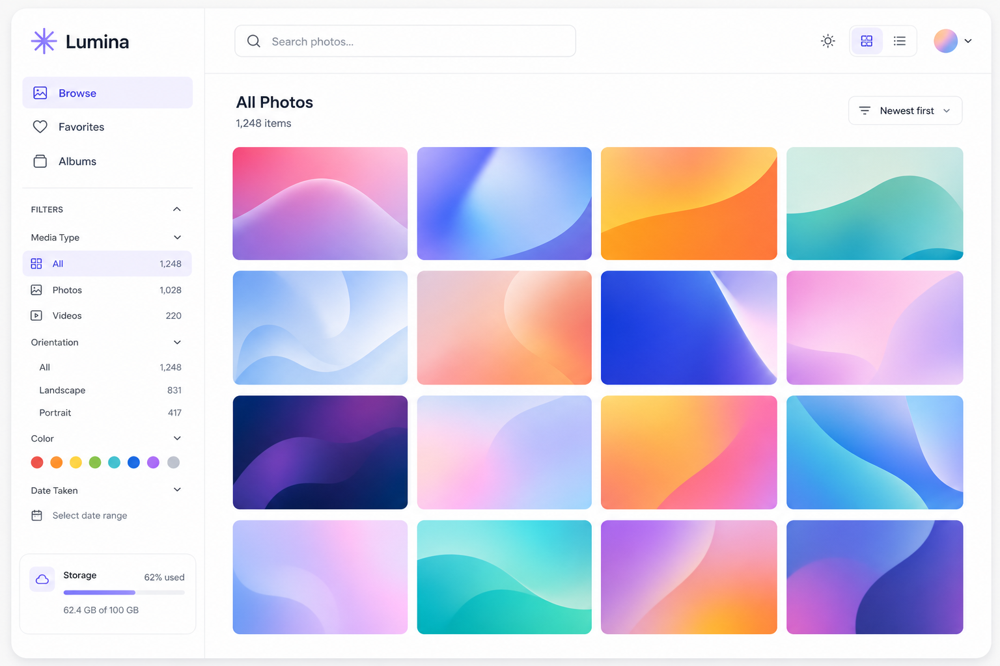
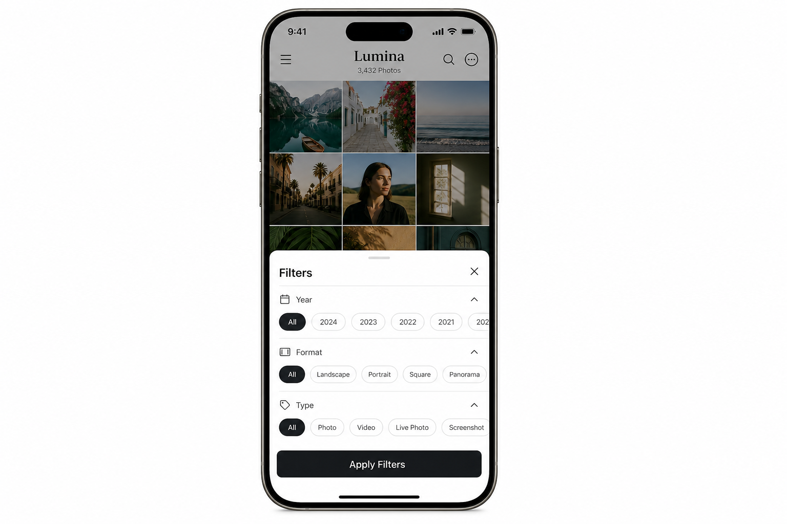
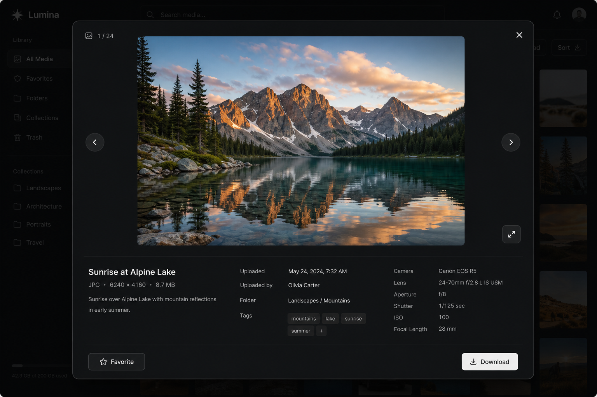

# Lumina

**Browse photos and videos on disk.** One Docker container, read-only folders, no Immich complexity.

A lean self-hosted gallery for libraries you already have — filter, favorite, album, and ZIP export without a database server or upload pipeline.



[](https://github.com/ayxos/lumina/actions/workflows/docker-publish.yml)
[](LICENSE)

## Why Lumina?

Immich and Piwigo are powerful, but often overkill if you just want to **explore existing files** on disk. Lumina is the middle ground:

- **Folder-based** — configure one or more read-only mount paths
- **Lightweight** — single Docker container, SQLite for metadata
- **Fast filters** — search by name, year (from filename), format, type, date, size
- **Favorites & albums** — curate collections, download albums as ZIP
- **Video support** — thumbnails via ffmpeg, streaming with HTTP range requests

## Screenshots

| Browse | Mobile filters | Lightbox |
|--------|----------------|----------|
|  |  |  |

## Features

- Grid gallery with lazy-loaded thumbnails
- **Year filter** from filename prefix (e.g. `20240820_174703.jpg` → 2024)
- Filter by folder, type (image/video/audio), format, date range, file size
- Favorites and custom albums
- Lightbox with keyboard navigation (← → Esc)
- Multi-select → add to album
- Auto-rescan on interval (default 60 min) + manual rescan
- Mobile-friendly UI with slide-up filter drawer

## Quick start

### Option A — Pre-built image (recommended)

```bash
git clone https://github.com/ayxos/lumina.git
cd lumina
mkdir -p media data
docker compose up -d
```

Uses `ghcr.io/ayxos/lumina:latest` — no build step.

### Option B — Build from source

```bash
git clone https://github.com/ayxos/lumina.git
cd lumina
docker compose -f docker-compose.yml -f docker-compose.build.yml up -d --build
```

### 1. Add your media

```bash
mkdir -p media
# copy or symlink your library, e.g.:
# ln -s /path/to/photos media/photos
```

### 2. Configure folders

Edit `config/settings.json`:

```json
{
  "mediaPaths": [
    { "name": "Photos", "path": "/media/photos" }
  ],
  "scanIntervalMinutes": 60,
  "thumbnailSize": 320
}
```

Paths must match **container** paths (right side of Docker volume mounts).

### 3. Open

**http://localhost:3080**

> **First time using GHCR?** The image is public. If pull fails, run:  
> `docker pull ghcr.io/ayxos/lumina:latest`

## Docker Compose

```yaml
services:
  lumina:
    image: ghcr.io/ayxos/lumina:latest
    ports:
      - "3080:3080"
    volumes:
      - ./config:/config
      - ./data:/data
      - ./media:/media/photos:ro   # read-only
    restart: unless-stopped
```

Multiple folders example:

```yaml
volumes:
  - ./config:/config
  - ./data:/data
  - /mnt/photos:/media/photos:ro
  - /mnt/videos:/media/videos:ro
```

```json
"mediaPaths": [
  { "name": "Photos", "path": "/media/photos" },
  { "name": "Videos", "path": "/media/videos" }
]
```

## Reverse proxy (optional)

Works behind Nginx Proxy Manager, Traefik, etc. Example NPM setup:

| Setting | Value |
|---------|-------|
| Domain | `media.example.com` |
| Forward | `127.0.0.1:3080` |
| SSL | Let's Encrypt |

For LAN/VPN split-DNS, point your local DNS (e.g. Pi-hole) at the same host IP so traffic stays on your network.

## Configuration reference

| Setting | Default | Description |
|---------|---------|-------------|
| `mediaPaths` | — | Named folder list to scan |
| `scanIntervalMinutes` | `60` | Auto-rescan interval |
| `thumbnailSize` | `320` | Thumbnail edge size (px) |
| `allowedExtensions` | see file | File types to index |

Environment variables:

| Variable | Default | Description |
|----------|---------|-------------|
| `PORT` | `3080` | HTTP port |
| `DATA_DIR` | `/data` | SQLite + thumbnails |
| `CONFIG_PATH` | `/config/settings.json` | Settings file |

## API

| Endpoint | Description |
|----------|-------------|
| `GET /api/media` | List with filters (`q`, `year`, `format`, `mediaType`, …) |
| `GET /api/media/:id/file` | Stream file (supports Range requests) |
| `GET /api/media/:id/thumb` | Thumbnail |
| `POST /api/favorites/:id` | Toggle favorite |
| `GET /api/albums` | List albums |
| `POST /api/albums/:id/items` | Add files to album |
| `GET /api/albums/:id/download` | Download album as ZIP |
| `POST /api/scan` | Trigger rescan |

## Architecture

```
┌─────────────┐     read-only      ┌──────────────────┐
│ Your folders│ ─────────────────► │ Lumina container │
│ on disk     │                    │  Express + SQLite│
└─────────────┘                    │  ffmpeg + sharp  │
                                   └────────┬─────────┘
                                            │
                                   ┌────────▼─────────┐
                                   │ ./data           │
                                   │  lumina.db       │
                                   │  thumbnails/     │
                                   └──────────────────┘
```

- **Original files are never modified** — mounts are read-only
- **Thumbnails & metadata** live in `./data`
- **Videos** — frame extracted at 1s via ffmpeg, cached as WebP

## Development

```bash
npm install
DATA_DIR=./data CONFIG_PATH=./config/settings.json node src/server.js
```

## License

MIT
